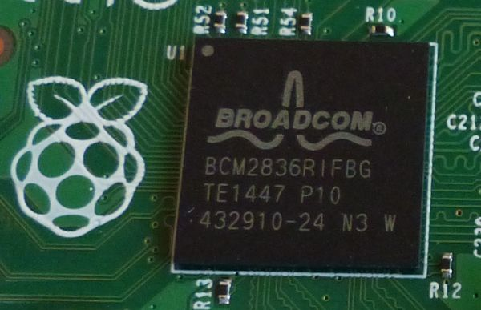
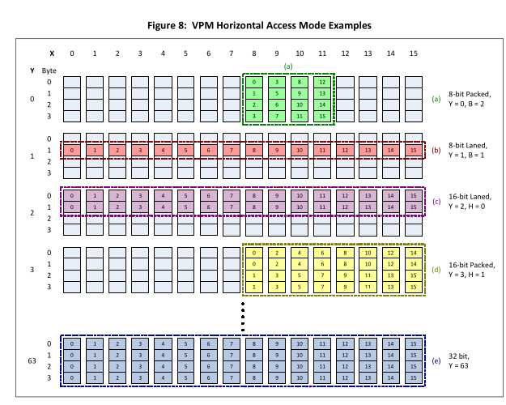

# The wonderful world of the VideoCore IV (Raspberry Pi GPU)


## Introduction

The Raspberry Pi uses the VideoCore IV GPU, also made by Broadcom. This was surprisingly well documented, all in this document: [VideoCore IV 3D Architecture Reference Guide](./docs/VideoCore%20IV%203D%20Architecture%20Reference%20Guide.pdf). To best take advantage of the GPU, we need to understand how it works. To start, here's a high-level overview of the VideoCore IV's architecture:

The GPU consists of 16 QPUs (quadcore processing units). The QPUs are technically 4-way SIMD processors (hence quad), but the actual execution is effectively 16-way virtual SIMD by use of multiplexing, and each of the QPU registers are 16-wide vector registers. Thus, we have 16 QPUs, each of which issue 16-wide vector instructions, providing up to 256 parallel execution lanes with SIMD (single instruction multiple data) within QPUs by virtue of the vector instructions, and SPMD (single program multiple data) across QPUs via the QPU scheduler. 

The GPU has two memory buffers: VPM (Vertex Pipeline Memory) and TMU (Texture Memory Unit). Since we are focusing on general purpose shaders, we will only use VPM (although there are existing UNIX implementations that are slightly faster using TMU. It would be great if someone could accelerate one of the VPM implementations using the TMU). If you're familiar with CUDA, the VPM is somewhat analogous to shared memory - multiple QPUs share one VPM, which can hold ~4KB of data.    

## Guide to the Docs

Before we go deeper, a quick cheat sheet to the docs for the Pi GPU. You can ignore most of this on a first pass, and come back to it when something you read later needs further explanation.

<b>[VideoCore IV 3D Architecture Reference Guide](./docs/VideoCore%20IV%203D%20Architecture%20Reference%20Guide.pdf) </b> 

There's a lot of information here, but pretty much everything you need to know is in the document above, and so far all the behavior we've seen from the GPU has been consistent with the docs. 

- Introduction p. 12 
- Architecture overview p. 13-25

- VPM and VCD p. 53-56 
Describes the VPM, which is the intermediate memory buffer in between physical memory and QPU registers. Memory flow is GPU registers <-> VPM <-> physical memory where the VPM/physical memory flow is done by DMA. 
- VPM/VCD Registers p. 57-59 
Describes how to configure the registers to set up loads and stores in the aforementioned memory flow. vc4asm has very helpful macros for this, but sometimes you need more fine-grained control. 
- V3D Registers p. 82-84 
The only ones we really care about are the ones written to in the QPU_EXECUTE_DIRECT function in our mailbox, and we still aren't 100% sure on why we have to write to these specifically. We couldn't get the mailbox execute QPU function to work, so we did it through the registers directly. 
- QPU Scheduler registers p. 89-91 
The important ones are program address, uniforms address, uniforms length, and user program request control/status. All you provide is an address to start executing code and an array of uniforms, and the scheduler runs the program and updates status. 

<b>[vc4asm Assembler for the QPU](https://maazl.de/project/vc4asm/doc/index.html) </b> 

This is what we'll use to actually write QPU kernels that we can launch ourselves. The assemb

[Build Instructions](https://maazl.de/project/vc4asm/doc/index.html#build): Make sure you have `.include "../share/vc4inc/vc4.qinc"` at the top of your qasm files. 
[Assembler](https://maazl.de/project/vc4asm/doc/index.html#vc4asm): To assemble a kernel titled `kernel.qasm`, run `vc4asm -c kernel.c -h kernel.h kernel.qasm`, add `#include "kernel.h"` to the file where you launch the kernel,  and add `kernel.c` to your `COMMON_SRC` in the Makefile. 
[Expressions and Operators](https://www.maazl.de/project/vc4asm/doc/expressions.html): The syntax is pretty similar to ARM assembly. Some key things to notice:
- Accumulators are registers `r0`...`r5`. It's generally a good idea to do arithmetic operations with these (adds, muls, fmuls, etc.). Note that r4 is read-only, so probably shouldn't be used. 
- Memory registers are `ra0`...`ra31` and `rb0`...`rb31`. From the Broadcom documentation (page 17-18):  
    <b>The QPU pipeline is constructed such that register files have an entire pipeline cycle to perform a read operation. As the QPU pipeline length from register file read to write-back is greater than four cycles, one cannot write data to a physical QPU register file in one instruction and then read that same data for use in the next instruction (no forwarding paths are provided). QPU code is expected to make heavy use of the six accumulator registers, which do not suffer the restriction that data written by an instruction cannot be read in the next instruction.</b>
In general, avoid using two registers from the same file (e.g. `ra1` and `ra2` or `rb7` and `rb25`) in the same instruction or in back-to-back instructions. Sometimes it'll will work without out a problem, sometimes the assembler will tell you you've written illegal code, and in the worst case it'll fail silently. You'll need to store data in the memory registers, so to be safe, always do a `mov r1, ra1` before operating on that data (assuming the data's in `ra1` and `r1` is an available accum register), and then do `mov ra1, r1` afterward to free up the accumulator for other use.
- There are several special purpose registers. 
  - The `unif` register holds the queue of uniforms, which you will provide when you launch the kernel. The workflow is straightforward - if you have  a 4-element unif array, say [1, 0x\<some address>, 12, 56], then you can do 
`mov ra1, unif; mov ra2, unif; mov ra3, unif; mov ra4, unif;` and `ra1` will be a 16-wide "uniform" vector with each value holding `4`,`ra2` will be a 16-wide "uniform" vector with each value holding `0x\<some address>`, etc. 
  - The `vr_setup/vr_addr/vr_wait/vw_setup/vw_addr/vw_wait/vpm` registers manage DMA loads/stores and VPM loads/stores (see below for more info). 
  - The `elem_num` register gives the index in the 16-wide vector - equivalently, it's a 16-wide vector that holds (0, 1, 2, ..., 15), and the `qpu_num` register holds which qpu your code is running on 
  - Several others we haven't, including for synchronization, interrupts, and unary operators

[Directives](https://www.maazl.de/project/vc4asm/doc/directives.html): Useful for constants, custom macros, etc. 

[Instructions](https://www.maazl.de/project/vc4asm/doc/instructions.html): Pretty digestible instruction set. Some quirks/useful things:

- Condition codes - recall that the QPU is 16-way SIMD. So an instruction with a condition code will only execute in the SIMD lanes in which that condition code applies (e.g. `mov.ifn` will only execute in lanes with the `N` flag set). To set the flags, you simply add `.setf` to the instruction (e.g. `add.setf`).  
- Branches - the entire 16-wide vector must branch together, so the condition codes for branches have an any/all prefix (e.g. `brr.anyn -, :loop` will branch to loop if any lane has the `N` flag set). IMPORTANT: before a branch actually branches, the processor will execute the 3 subsequent instructions after the branch. It's generally safest to just make these 3 nops, unless you want to do something clever with these 3 instructions. 


## Part 0: deadbeef - a minimal, illustrative VideoCore IV program 

To understand the workflow of a VideoCore IV program, we will start with a "hello-world" example. The goal of this program is to prove that we can communicate the GPU by writing to memory from the GPU and reading back the same value from the CPU. This takes a surprising amount of work, and proceeds in multiple stages.

### The `struct GPU`

<i>Brief aside - because we're on bare-metal, the GPU and CPU see the same physical memory, but at different addresses. For our Pi, the CPU address is 0x40000000 lower than the GPU address, so if the CPU writes to address 0x100, the GPU can read it at 0x40000100. Going forward, this is what we mean by GPU Address/CPU Address. </i>

At the core of every GPU program on the Raspberry Pi is a `struct GPU`, which varies slightly depending on the program, but follows the same general structure shown below.
```c
struct GPU
{
        uint32_t input[SOME_SIZE];
        uint32_t output[SOME_SIZE];
        ///Other program-buffers as needed
	uint32_t code[CODE_SIZE];
	uint32_t unif[NUM_QPUS][NUM_UNIFS];
	uint32_t unif_ptr[NUM_QPUS];
	uint32_t mail[2];
	uint32_t handle;
};
```
The top of the struct holds any buffers your program needs. For example, a matrix multiplication might have 3 2D arrays, for the two input matrices and the single output matrix. Next, is the `code` array. Although the QPU uses 64-bit/8-byte instructions, the vc4asm assembler we use outputs these instructions as an array of 32-bit values, so we store them as such. Next, is the 2D `unif` array. Uniforms are parameters your QPU kernel can read and use. For example, you almost always need to pass the GPU address and size of the input/output array(s) as uniforms so that your QPU kernel knows where and how much to read from/write to. When you schedule your program to run on multiple QPUs, each QPU gets its own uniforms array, so you can (and often should) vary your uniforms by QPU when running on multiple QPUs. The `unif_ptr` array holds the GPU base address of the `unif` array for each QPU - this is what will ultimately get passed to the scheduler to launch each QPU. The first word of the `mail` array is the GPU address of the `code` array, and the second word is the GPU address of the base of the 2D `unif` array. Finally, the handle is what's returned by the mailbox `mem_alloc` call to allocate memory on the GPU - more details later. Below is the struct GPU we use for the Deadbeef program:  
```c
struct GPU
{
	uint32_t output[64];
	uint32_t code[sizeof(deadbeef) / sizeof(uint32_t)];
	uint32_t unif[1][1];
	uint32_t unif_ptr[1];
	uint32_t mail[2];
	uint32_t handle;
};
```
The goal of the program is to fill the output array from the GPU and read it from the CPU. Our code will be in a C-array of 32-bit values called deadbeef. Finally, we will only run on 1 QPU, and our only uniform will be the GPU address of the output array. 

### Mailbox and GPU Execution

So now that we have this struct GPU defined, how do we initialize it? What do we do with it? The answer comes from our old friend all the way back in lab 1, the mailbox. The key purpose of the `struct GPU` is allowing us to have shared state between the CPU and GPU. To make this happen, we need to allocate memory on the GPU and be able to write to that memory from the CPU. We do so using the following sequence of mailbox calls (the deadbeef code has some error-checking but is functionally the same):

```
//Turn on qpu
qpu_enable(1) 

//Allocate page-aligned, cached memory on the GPU for our struct gpu
uint32_t handle = mem_alloc(sizeof(struct GPU), 4096, GPU_MEM_FLG); 

//Claim access to the allocated memory and get the GPU address 
uint32_t vc = mem_lock(handle);

//Shift the pointer to a CPU address we can write to
ptr = (volatile struct GPU *)(vc - GPU_BASE); //GPU_BASE = 0x40000000

//And voila! Now we can start filling in our struct GPU and rest easy knowing that the GPU will see it.
ptr->... = ...
```
Once we have allocated our `struct GPU` as shown above, we can start filling it in. The input/output buffers should be filled specific to your program - with deadbeef, we memset the output to 0xffff.... to confirm we've actually changed something. You `memcpy` the assembled code array from vc4asm into the `code` array. The `unif` array is also initialized specific to your program - for deadbeef, our only uniform is the GPU address of the output array, which we can get by adding the GPU base to the address of ptr->output. Similarly, our single entry in `unif_ptr` is defined as `GPU_BASE + (uint32_t)&gpu->unif[0]`, mail[0] is `GPU_BASE + (uint32_t)&gpu->code`, and mail[1] is `GPU_BASE + (uint32_t)&gpu->unif`. The `handle` is the same we got from `mem_alloc`.

There's technically a mailbox call to execute code on the GPU, but we couldn't figure out how to get that to work (please let us know if you do!). Instead, to get the code to run we had to directly write to the GPU control registers as you would any of other hardware peripherals we've worked on. After clearing the V3D caches/interrupts, we execute as follows:
```
// Launch shader(s)
for (unsigned q = 0; q < num_qpus; q++) {
  PUT32(V3D_SRQUA, (uint32_t)unif_ptr[q]); // Set the uniforms address
  PUT32(V3D_SRQPC, (uint32_t)code); // Set the program counter
}
// Busy wait polling
while (((GET32(V3D_SRQCS) >> 16) & 0xff) != num_qpus);
```
For each QPU, we take write the GPU base address of its corresponding 1D uniform array to the V3D_SRQUA register and the GPU base address of our code to the V3D_SRQPC register (technically you can have different code for each QPU the way we have different uniforms, but doesn't really make much sense). Then, we poll the status register for the number of qpus done executing until it matches the number we launched. All of this is outlined in the docs (page 90-92 of the [manual](./docs/VideoCore%20IV%203D%20Architecture%20Reference%20Guide.pdf)).

### Writing QPU Kernels
This is where things get fun. In order to run code on the GPU, you have to actually have code to run, which means writing bare-metal GPU kernels; you can tell all the CS149 posers that CUDA is for suckers, real performance engineers write their kernels in machine code.

The key conceptual hump for writing QPU kernels is understanding how memory moves around. As stated above, the flow of data is registers <=> VPM <=> Physical memory, and the most important part to understand is the middleman - the VPM.


### VPM Read/Write



As mentioned above, the VPM has almost exactly 4KB of memory, which is laid out as a 16-wide 64-high 2D array of 4-byte words (16 * 64 * 4 = 4096 bytes). The most natural way to read/write from the VPM is 16-wide horizontal vectors, but the QPUs can use a massively broad and expressive range of accessing patterns on the VPM, all of which are outlined in pages 53-56 of the docs. In order to use the VPM, you have to configure how you're going to be using it. This is done using the `vr_setup` and `vw_setup` registers (as defined by vc4asm). For DMA reads/writes (VPM <=> Physical memory), you have to use the `vdr_setup_0` and `vdw_setup_0` macros (also defined by vc4asm) to describe what you'll be doing, and for loads/stores (VPM <=> Registers), you have to use the `vpm_setup` macro to describe what you'll be doing. These macros are extremely helpful, and you can also see the 32-bit values they correspond to by looking at the 'QPU Registers for VPM and VCD Functions' starting on page 57 on the docs - sometimes it is necessary to do direct arithmetic with these values (e.g. vr_setup = vpm_setup(some args) + some val), when some val could be a variable row in the VPM. 

#### How to actually use these
The [vc4asm docs](https://maazl.de/project/vc4asm/doc/vc4.qinc.html#VPM) on these macros is your absolute best friend here. The deadbeef example is an illustrative example for how to use them, but note that it only writes, i.e goes registers=>VPM=>Physical Memory (sometimes your kernel may need to read an input buffer as well). To write this data, it starts by configuring a VPM store in the `vw_setup` register. The program is going to store 4 16-wide horizontal vectors 1 at a time, and it would like to write the first starting at (y,x) coord (0,0), the second starting at (1,0), the third at (2,0), and the 4th and (3,0). To do so, it does: `mov vw_setup, vpm_setup(4, 1, h32(0))`, which corresponds to write 4 rows, increment by 1 after each write, and write horizontal 32-bit vectors start at y value 0. It then carries out the writes, by treating the `vpm` register like any other register (`ldi vpm, 0xdeadbeef`) just writes `0xdeadbeef` to the `vpm`. After each write, the program executes a `mov -, vw_wait` to ensure the write completes, then writes out the following 3 values. Recall that each of these writes is a 16-wide vector. After the VPM writes are complete, the program then prepares a DMA write using the `vw_setup` register once again, only this time using the `vdw_setup_0` macro. Here, the macro invocation `vdw_setup_0(4, 16, dma_h32(0,0))` corresponds to 'write 4 rows of the VPM, each of them 16 wide, horizontal 32-bit starting at VPM coord 0,0'. Because we're writing to physical memory, we also have to specify the `vw_addr` register, which in this case is just the uniform we provided when we launched the kernel. Finally, we do a `mov -, vw_wait` to kick of the DMA write.  And that's it! A complete hello-world program on the GPU, and we're only ... about 2,700 words into the README. 

#### Running deadbeef
Running `bash.sh` will reassemble the qasm and then run make. You can also just run make. You should see the memory update to the constants in deadbeef after the GPU executes. 

## Part 1: Parallel Add

The first program you'll implement is a SIMD vector add on a single QPU. `parallel-add.c` and `parallel-add.h` have a lot of the boiler-plate for executing QPU code we described above - you have the input A and B arrays and the output C arrays in the `struct GPU` and their addresses in the uniform array - you can decide any other uniforms you need. The kernel is in `parallel-add.qasm` - we've added a skeleton if you'd like, but this would also be great to Daniel-mode directly from the deadbeef example and vc4asm docs. 

Checkoff: Your kernel should calculate the same values as the CPU implementation, with a meaningful speedup (we had a 3-4x speedup on 1 QPU, better should be possible).  

## Part 2: Mandelbrot
<figure>

<figcaption><i>who knew the Pi could produce something so beautiful</i></figcaption>
</figure>

The final program we'll implement is a Mandelbrot kernel. Calculating which points are in the Mandelbrot set is very computationally intensive, but each point is calculated completely independent of all others, so it's an excellent candidate for GPU acceleration. The [Wikipedia](https://en.wikipedia.org/wiki/Mandelbrot_set) is a helpful reference if you're unfamiliar with how Mandelbrot is calculated. For this kernel, we'll be using multiple QPUs, and the additional necessary boilerplate is included in the starter code. The parallelization scheme used by the starter-code is described below, but you're absolutely free to design your own and adapt the code as such.

Parallelization scheme: We parallelize the columns using the 16-wide SIMD vector and we parallelize the rows by the number of QPUs. Equivalently, index i in the SIMD vector is responsible for computing every column n where n % 16 = i, and QPU j is responsible for computing every row m where m % NUM_QPUS = j. Note that this requires that the resolution be divisible by 16 and NUM_QPUS - it would be better to handle cases that don't divide nicely. In C-like code, this looks like:
```
for (int i = MY_QPU_NUM; i < HEIGHT; i += NUM_QPUS) {
  for (int j = MY_VECTOR_INDEX; j < WIDTH; j += 16) {
    compute(Output[i][j]);
  }
}
``` 
Note that with SIMD, the inner loop is more accurately described as:
```
for (int i = MY_QPU_NUM; i < HEIGHT; i += NUM_QPUS) {
  for (int j_base = 0; j_base < WIDTH; j_base += 16) {
    compute(Output[i][j_base...j_base+15]);
  }
}
```
because each 16-wide vector is computed in lockstep fashion.

For this one, all the code is in mandelbrot.qasm - fill in the TODOs to complete the kernel. 

Checkoff:
When you do bash run.sh for with 2-mandelbrot.c in your progs, you should get an output.pgm file on your pi SD card. When it opens on your computer, it should be the Mandelbrot fractal at the resolution you defined (probably don't go bigger than 1024 for the resolution),


## Useful Links

- [VideoCore IV 3D Architecture Reference Guide](./docs/VideoCore%20IV%203D%20Architecture%20Reference%20Guide.pdf)
- [vc4asm](https://maazl.de/project/vc4asm/doc/index.html)
- [Pete Warden's Blog](https://petewarden.com/2014/08/07/how-to-optimize-raspberry-pi-code-using-its-gpu/) and [code](https://github.com/jetpacapp/pi-gemm)
- [Macoy Madson's Blog](https://macoy.me/blog/programming/PiGPU)
- [gpu-deadbeef](https://github.com/0xfaded/gpu-deadbeef)
